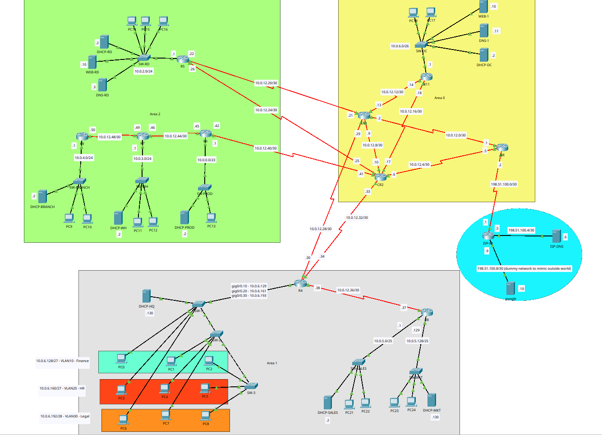

# KtmTechnologies Enterprise Network

Multi-area OSPF network for KtmTechnologies, built in Cisco Packet Tracer.

- **10 routers**, 3-area OSPF (backbone + Area 1 + Area 2)
- **10 LAN/VLAN subnets**, VLSM on 10.0.0.0/16
- **14 point-to-point links**, redundant core (CR1/CR2)
- **VLANs**: Finance (10), HR (20), Legal (30) via router-on-a-stick on R4
- **DHCP**: local + relayed per VLAN group
- **DNS**: recursive-style delegation chain (DNS-RD → DNS-1 → ISP-DNS)
- **Security**: console/enable/Telnet passwords on every router

Full details in `CN_final_report_079bct080.pdf`.

**Author:** Shrine Sigdel — 079BCT080
